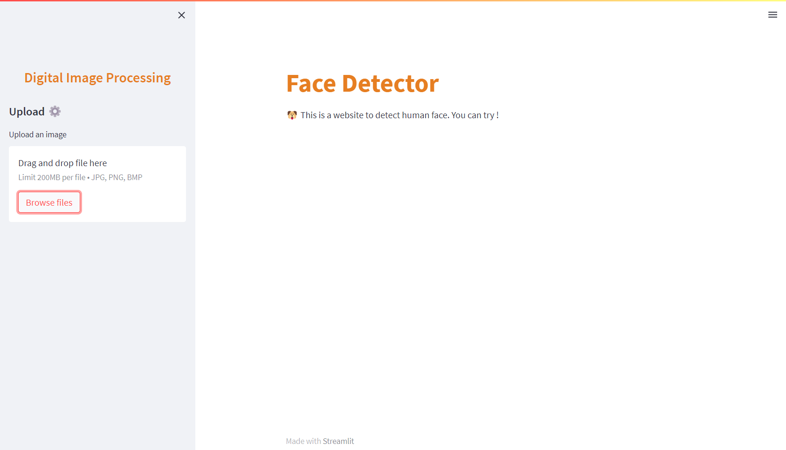
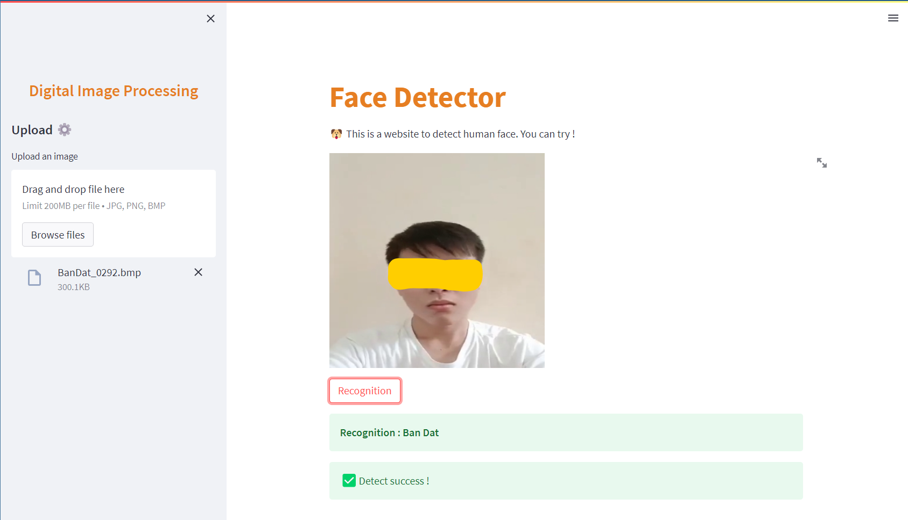

# Digital Images Processing

This is my digital image processing's  project, this using the facebook's model to recognize human face.

### Technology:
- Facebook model
- Streamlit
- Python

### Home page

This is home page of detection website. 

Home page after recognize.

### How to run

Follow the steps in the `sources` directory. Rememmber add `video`, `image`, `test` folder before run it.